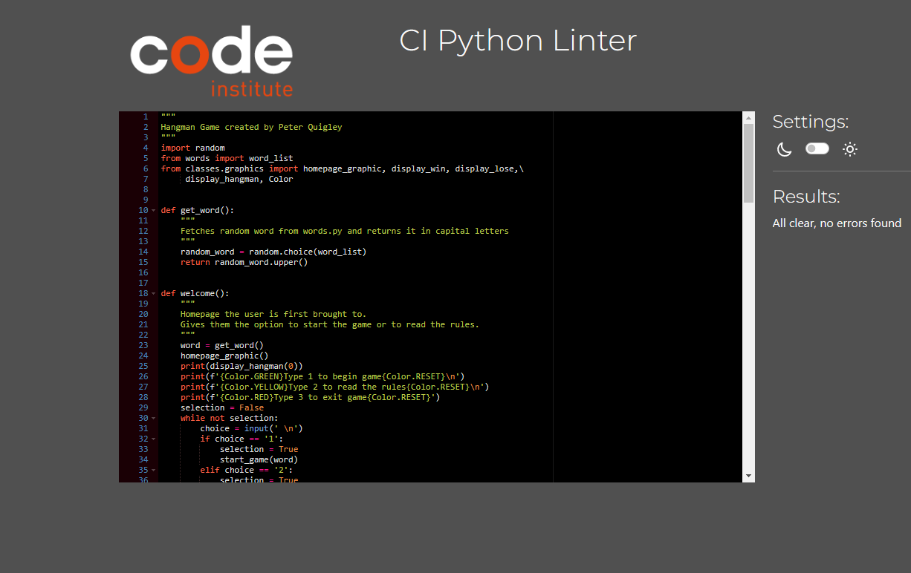
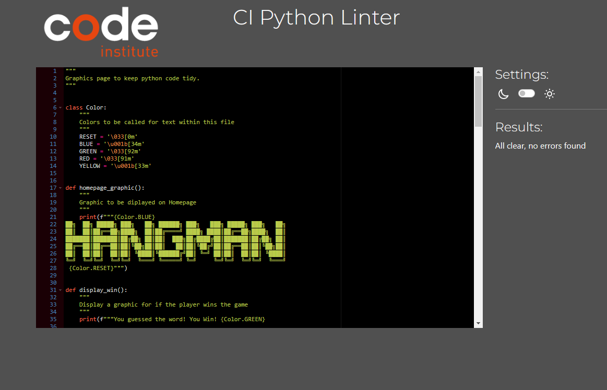
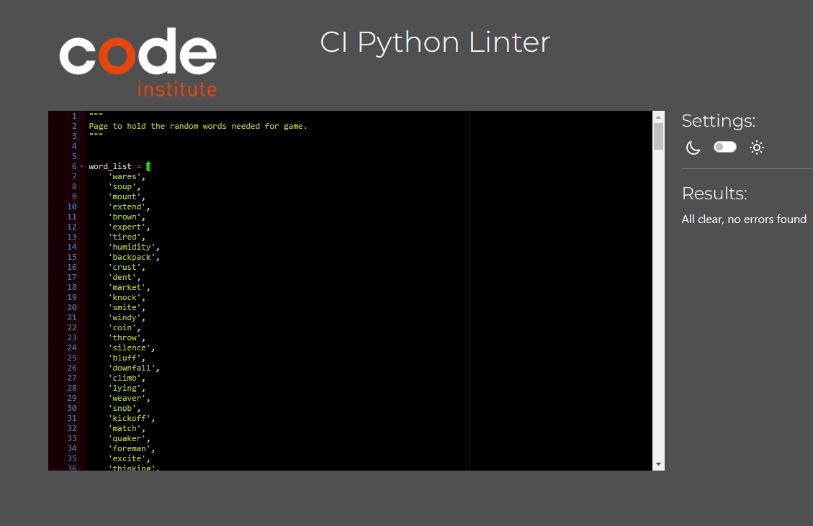

# **Hangman Game**

## **Introduction**

Hangman is a classic game played all over the world. The aim is to guess the word in 3-6 tries. If the user guesses the word before they run out of wrong tries, they win the game. If the user does not guess the word then its game over. The user can choose which diffiulty they want to play with a range from 3 to 6 guesses.The user is then asked if they would like to play again. With every failed guess more and more features of a stick figure would appear on the gallows until it is complete.

​
## Table of contents:
1. [**Planning stage**](#planning-stage)
    * [***Target Audiences***](#target-audiences)
    * [***User Stories***](#user-stories)
    * [***Site Aims***](#site-aims)
    * [***Page Layout***](#page-layout)
1. [**Features**](#features)
    * [**Main Menu**](#main-menu)
    * [**Rules**](#rules)
    * [**Difficulty**](#difficulty)
    * [**Game Started**](#game-started)
    * [**Wrong Inputs**](#wrong-inputs)
    * [**Letters Tried**](#letters-tried)
    * [**Hangman Progress**](#hangman-progress)
    * [**Game Over Messages**](#game-over-messages)
1. [**Testing Phase**](#testing-phase)
    * [**Python Linter Testing**](#python-linter-testing)
    * [**Manual Testing**](#manual-testing)
1. [**Bugs**](#bugs)
1. [**Deployment**](#deployment)
1. [**Credits**](#credits)
   
## **Planning stage**

### **Target Audiences**

- All ages above 10
- All levels
- English speakers
- English students
- Users who want to kill a little time by completing a word game instead of being on social media.

### **User Stories** 

- As a user, I would like to know how to play the game.
- As a user, I want to be able to select a difficulty which changes the amount of tries i start with.
- As a user, I would like to know how many letters there are in the word i have to guess.
- As a user, I want to be able to see how many tries i have left.
- As a user, I would like to know the answer at the end of the game if i get it incorrect.
- As a user, when i already submit a letter i have already put in, I do not want to lose a try.
- As a user, I would like to play the game as many times as i want.
- As a user, I want to be able to replay the game once I've finished.
- As a user, I want to be able to see a visual representation of the hangman.
- As a user, I want to be able to exit the game.

### **Site Aims**

- Provide a game that runs smoothly.
- Provide quick yet challenging entertainment.
- Provide an easy to use interface.
- Provide the use with no errors.
- Provide people with an alternative to social media.

## **Features**

### **Main Menu**

- This Main Menu is the first thing the user sees. It gives them two options if they are unfamiliar with the game they can read the rules, Or if they know how to play they can proceed and play. I added a bit of colour to the two options so they would stand out. Above the two options displays the name of the game and the final stage of the hangman.

### **Rules**

- After the main menu, if the player selects the option to read the rules this is what will come up on the terminal. A numbered set of rules starting at 1 and ending at 7. If the player hits the Enter key it will then bring them back to the main menu.

### **Difficulty**

- Once you pick option 1 to play the game you get to choose the difficulty you want to pick.
There are 3 options Easy, Medium and Hard. Easy gives you 8 chances, Medium gives you 6 chances and Hard gives you 4 chances.

### **Game Started**

- Once the game starts the position the user starts in becomes visible. The user can see which difficulty they picked and how many lives they have. They then can see how long the word they have to guess is and it will tell the user what guesses they have already picked. If the user gets a letter wrong the hanging will begin.

### **Wrong Inputs**

- If the user puts in the the wrong letter it will give them a message at the top of the terminal telling them that is not the letter there looking for.
- If the user trys to put in two letters it will provide a message at the top of the terminal explaining to only use one letter at a time.
- If the user puts in any character other than a letter it will give them a message telling them they can only provide letters.

### **Letters Tried**

- In order to keep track of which letters have been tried, the used ones will be displayed to avoid reuse.
- The user won't lose any chances if the mistakenly try the same letter again. 
- They will also get a message if they type in the same letter twice.

### **Hangman Progress**

- Every choice updates the progress by at least add a new letter to the used bank.
- When incorrect guesses are made the player loses a chance.
- The man is then one step closer to the gallows.
- With every round an image showing how close he is to hanging will be displayed.

### **Game Over Messages**

- Depending on the result of the users game they will get one of these two messages.
- If the word is guessed correctly they will get the win message.
- If the word is guessed wrong they will get the game over message.
- Both messages are ASCII art messages from (https://patorjk.com/software/taag/#p=testall&f=3D%20Diagonal&t=Hangman).
- Once the user gets either message they have the option to play again or not and head back to the main menu.
- The win message is in green and tells the user well done.
- The game over message is displayed in red and has the final stage of the hanging above the game over message.
- After the game over message it also tells the user the word they could not get.

## **Testing Phase**

### **Python Linter Testing**

- I ran my 3 python files through Code Institutes Linter.
- All 3 files passed the test.

### **Manual Testing**

- Implementation: At the start of the game, the user has 3 options 1. play the game 2. read the rules and 3. exit the game.
- Test: To test this i entered each option and they all work, i also tried to enter different characters.
- Result: Adding anything other than 1, 2 or 3 will not be accepted. If you enter 1 you are brought to the start of the game where you chose a difficulty. If you enter 2 the user is brought to a set of rules which will explain the game to them if they have not played before. If you enter 3 you exit the game.

- Implementation: Once you enter option 1 you are given a menu with 3 difficultys Easy, Medium or Hard. The user should only be able to enter E, M or H.
- Test: To test this i entered each option they all worked fine. 
- Result: You cannot enter anything other E, M or H. 

- Implementation: Making sure the user can only enter letters and the user can see how many letters are in the word.
- Test: I put in 2 letters at a time, I also put in characters like @.
- Result: If i put in 2 letters the terminal tells me it only accepts one letter, If i put in a special character the terminal tells me it can only accept letters. I can also see how many letters are in the word printed in the terminal.

- Implementation: Making sure the user can see how many tries he has left and that the hangman graphic works correctly once the answer is wrong.
- Test: I played the game and entered letters to guess the word.
- Result: Everytime i got it right the letter was added to the word, But everytime i got it wrong i got a chance taken from me and the hangman added some more of the gallows. At the bottom of the terminal it also told me every letter i entered to stop the user entering the same letter twice, But if i did enter it twice the game would not accept it or take a life from me.

- Implementation: If the user loses the game they get to see the word they could not get and have the chance to play the game again or go back to the welcome menu. 
- Test: I played the game and lost all my chances.
- Result: The word i could not get was shown to me and i had the option to play the game again or go back to the main menu. 

- Implementation: If the user wins or loses the game the graphics show at the end of the game.
- Test: I played the game and won and lost.
- Result: For the win the user got the correct graphic and if they lost they also got the correct one.

## **Bugs**

- When adding some of the Hangman graphic there was trailing whitespace or errors with some of the backslash and forward slashes.
- To fix this i had to delete the whitespace and in some cases add another forward or backslash.

- Originally i had the difficulty built into the start game function but i wanted to tidy up the code and put it in its own function but once i done that i was getting errors because the chances variable is declared there and could not declare it again in the difficulty function.
- To fix this i declared another variable in the difficulty function called lives and returned that from the function which is then called in the chances variable in the start game function.

- I found when i had all the graphic functions in the run.py file it made the page long and untidy.
- To fix this i put all the graphic functions into a graphics.py file and imported them then in the top of my run.py file this made the project alot easier to read.

​
***
## **Deployment**

1. Push your code to GitHub
2. Log in or Sign up to Heroku where you need to create a new app.
3. Select a unique name.
4. In the settings tab reveal the config vars, for this project one had to be added per Code Institutes guidance.
5. For KEY, input PORT and for VALUE, imput 8000 and click add.
6. Below that, click add buildpack, select Python and save.
7. Click add buildpack again, now select Nodejs and save.
8. Python should be above Nodejs on the buildpack list.
9. Go to deploy tab and for deployment method select GitHub and connect your GitHub account.
10. When prompted enter the repository you want to deploy, search and once found connect it.
11. Now you can either set it automatically or manually deploy the appropriate branch.
    - Automatically will deploy the app everytime you push something to GitHub.
    - Manually you have control over when the app should be deployed, but you have to remember to do it.
12. It might take a little while, but once the app is built Heroku will have a link to the live web page.

You can find the live site via the following URL - [Hangman Game](https://hangman-pq.herokuapp.com/)
***
​

​
## **Credits**

- [ASCII Art](https://patorjk.com/software/taag/#p=testall&f=3D%20Diagonal&t=Hangman) - Where i found the ASCII Art for the graphics page.
- [Kite Youtube Tutorial](https://www.youtube.com/watch?v=m4nEnsavl6w) - Where i got the insporation for this project and some of the structure of the code.
- [Stack Overflow](https://stackoverflow.com/questions/287871/how-do-i-print-colored-text-to-the-terminal) - This helped me figure out how to use color in the terminal.
- Richard my mentor for all the help and wisdom.

​
​