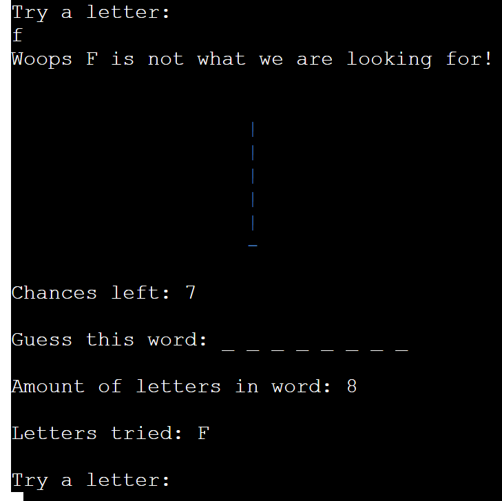
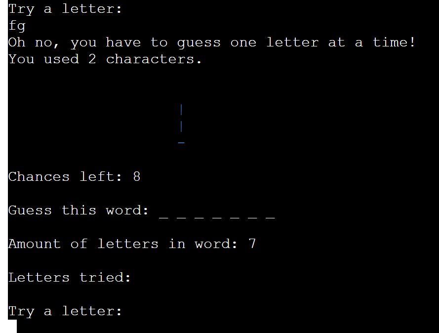
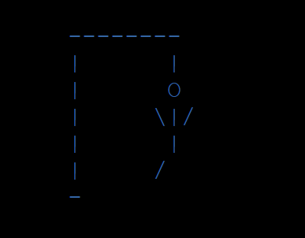

# **Hangman Game**

## **Introduction**

Hangman is a classic game played all over the world. The aim is to guess the word in 3-6 tries. If the user guesses the word before they run out of wrong tries, they win the game. If the user does not guess the word then its game over. The user can choose which diffiulty they want to play with a range from 3 to 6 guesses.The user is then asked if they would like to play again. With every failed guess more and more features of a stick figure would appear on the gallows until it is complete.

​
## Table of contents:
1. [**Planning stage**](#planning-stage)
    * [***Target Audiences***](#target-audiences)
    * [***User Stories***](#user-stories)
    * [***Site Aims***](#site-aims)
    * [***Page Layout***](#page-layout)
1. [**Features**](#features)
    * [**Main Menu**](#main-menu)
    * [**Rules**](#rules)
    * [**Difficulty**](#difficulty)
    * [**Game Started**](#game-started)
    * [**Wrong Inputs**](#wrong-inputs)
1. [**Testing Phase**](#testing-phase)
1. [**Bugs**](#bugs)
1. [**Deployment**](#deployment)
1. [**Credits**](#credits)
   
## **Planning stage**

### **Target Audiences**

- All ages 
- All levels
- English speakers
- English students
- Users who want to kill a little time by completing a word game instead of being on social media.

### **User Stories** 

- As a user, I would like to know how to play the game
- As a user, I would like to know the answer at the end of the game if i get it incorrect.
- As a user, I would like to know how many letters there are in the word i have to guess.
- As a user, I would like to play the game as many times as i want.
- As a user, I want to be able to select a difficulty which changes the amount of tries i start with.
- As a user, I want to be able to see how many tries i have left.
- As a user, when i already submit a letter i have already put in, I do not want to lose a try.
- As a user, I want to be able to replay the game once I've finished.
- As a user, I want to be able to see a visual representation of the hangman.

### **Site Aims**

- Provide a game that runs smoothly.
- Provide quick yet challenging entertainment.
- Provide an easy to use interface.
- Provide the use with no errors.
- Provide people with an alternative to social media.

## **Features**

### **Main Menu**

This Main Menu is the first thing the user sees. It gives them two options if they are unfamiliar with the game they can read the rules, Or if they know how to play they can proceed and play. I added a bit of colour to the two options so they would stand out. Above the two options displays the name of the game and the final stage of the hangman.

### **Rules**

After the main menu, if the player selects the option to read the rules this is what will come up on the terminal. A numbered set of rules starting at 1 and ending at 7. If the player hits the Enter key it will then bring them back to the main menu.

### **Difficulty**

Once you pick option 1 to play the game you get to choose the difficulty you want to pick.
There are 3 options Easy, Medium and Hard. Easy gives you 8 chances, Medium gives you 6 chances and Hard gives you 4 chances.

### **Game Started**

Once the game starts the position the user starts in becomes visible. The user can see which difficulty they picked and how many lives they have. They then can see how long the word they have to guess is and it will tell the user what guesses they have already picked. If the user gets a letter wrong the hanging will begin.

### **Wrong Input**

- If the user puts in the the wrong letter it will give them a message at the top of the terminal telling them that is not the letter there looking for.
- If the user trys to put in two letters it will provide a message at the top of the terminal explaining to only use one letter at a time.
- If the user puts in any character other than a letter it will give them a message telling them they can only provide letters.

## **Testing Phase**

## **Bugs**

​
***
## **Deployment**

I deployed the page on GitHub pages via the following procedure: -
​
1. From the project's [repository](pageurl), go to the **Settings** tab.
2. From the left-hand menu, select the **Pages** tab.
3. Under the **Source** section, select the **Main** branch from the drop-down menu and click **Save**.
4. A message will be displayed to indicate a successful deployment to GitHub pages and provide the live link.
​
You can find the live site via the following URL - [Computer Knowledge](https://peterq93.github.io/quiz/)
***
​

​
## **Credits**

​
​